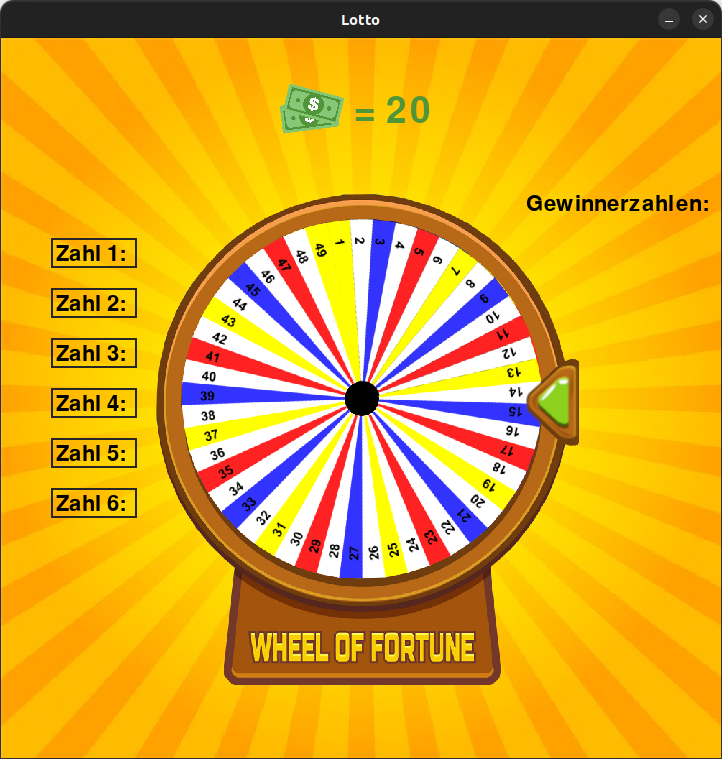

# Lotto

A number guessing game using [Pygame](https://github.com/pygame/pygame).

  

## Usage

Install python and pip, if you do not already have them, and run `pip install pygame`.
Clone the repository to your machine, cd in the lotto folder and run `python lotto.py`.
